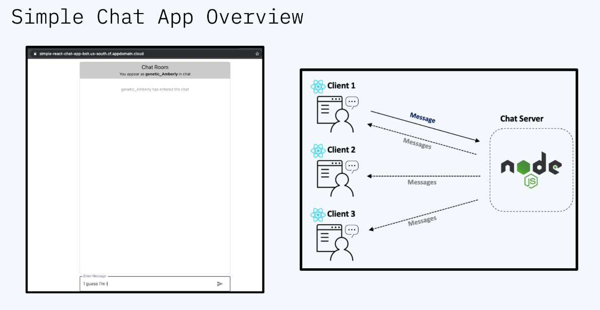
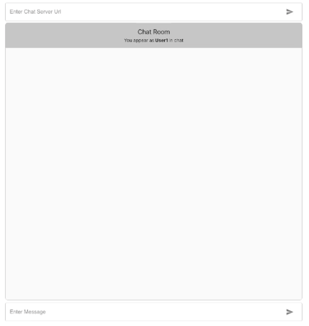

# Chat-app
Bienvenidos a la aplicación chat de ejemplo 
Esta aplicación tiene una arquitectura sencilla, orientada a que entiendas los conceptos básicos de conteinerización usando Docker y despliegue en Openshift. 
Sigue los pasos a continuación para construir y desplegar la aplicación 
Este workshop te ayudará a entender las interioridades de la tecnología de contenedores, y como ayuda al desarrollo y despliegue de una aplicación.
Utilizaremos Red Hat Openshift como nuestra plataforma de referencia para desplegar la aplicación conteinerizada y así entender también parte de sus capacidades.

## Arquitectura y flujo de acciones

<p align="center">
  </img>
</p>

-	El usuario interactúa con el chat a través de una aplicación cliente desarrollada usando el framework de React.
-	El chat envía y recibe los mensajes del servidor Node.js desplegado en Openshift.
-	Los diferentes mensajes se van agregando y acomodando en el chat.

## Lab 1. Conteninerizando nuestra aplicación.

### Paso 1. Generando el Dockerfile

Lo primero que tenemos que hacer es clonar este repositorio en tu máquina:

```
git clone https://github.com/luisreyesoliva/simple-chat-app.git
```

Ahora abriremos una sesión de terminal en el directorio donde hemos clonado la aplicación cliente (React Chat App):

```bash
cd <location-path>/react-chat-client
```

Vamos a crear un fichero llamado Dockerfile (sin extensión) donde indicaremos las instrucciones para generar la imagen del contenedor de nuestra aplicación de chat. 

Cada linea que se ejecute en este Dockerfile generará nuevas capas sobre la imagen base de node de la cual partimos para conteninerizar nuestra aplicación y generar todo lo necesario para ejecutar la aplicación React en nuestro entorno.
El Docker file está configurado en dos stages (Build y Run) para generar la aplicación y ejecutarla sobre un servidor de Nginx (que también es un contenedor). Copia las siguientes instrucciones en el fichero que has creado: 

```bash
#Build Steps
FROM node:alpine3.10 as build-step

RUN mkdir /app
WORKDIR /app

COPY package.json /app
RUN npm install
COPY . /app

RUN npm run build

#Run Steps
FROM nginx:1.19.8-alpine  
COPY --from=build-step /app/build /usr/share/nginx/html
```

Para aprender más sobre el proceso de conteinerización de una aplicación React, te recomiendo que visites esta página: [Dockers and Dad Jokes: How to Containerize a ReactJS Application](https://ibm.biz/how-to-containerize-react-app-031821-bradstondev)

### Paso 2: Creando el .dockerignore

Lo siguiente será crear un fichero _.dockerignore_. Este fichero nos permitirá "ignorar" determinados ficheros a la creación de nuestra imagen y así ahorrar algo de tiempo al construirla y evitar sobreescrituras accidentales. Es habitual ver este fichero en un entorno Docker.

```bash
node_modules
build
.dockerignore
Dockerfile
Dockerfile.prod
```

### Paso 3: Construir la imagen Docker

Lo siguiente va a ser construir la imagen Docker que definirá lo que queremos ejecutar en nuestro contenedor. Este es el formato del comando Docker que debemos usar en nuestro terminal.

```bash
docker build -t <image-name>:<tag> .
```
Esto es lo que va a suceder:
* _docker build_ inicia el proces de construcción de la imagen
* _-t_ permite tagear la imagen en formato 'nombre:tag'
* _image-name_ es el nombre que queremos dar a la imagen
* _tag_ is es el tag para la versión de la imagen que vamos a construir. Se suele usar para identificar diferentes versiones de la imagen a desplegar.
* _._ indica el path desde el que todo será construido (y que contiene un Dockerfile). NOTA: Es imprescindible para que el comando funcione, no lo olvides!

En nuestro caso, este es el comando que usaremos (pon otro nombre si lo prefieres).

```bash
docker build -t chat-app-client:v1 .
```
### Paso 4: Arrancando la aplicación

Ahora pongamos nuestro contenedor en acción. 

Para ello ejecuta el siguiente comando:

```bash
docker run -p 8080:80/tcp -d <image-name>:<tag>
```

Esto es lo que va a pasar:
* _docker run_ ejecuta nuestra imagen Docker en forma de contenedor
* _-p_ se usa para indicar el puerto de nuestro host en que queremos exponer nuestro contenedor
* _8000:80/tcp expone la aplicación, que está hosteada en un servidor de Nginx en el puerto 80 de nuestro contenedor, sobre el puerto 8000 de nuestra máquina local.
* _-d_ hace que el contenedor se ejecute en background, permitiendo que podamos seguir usando nuestra sesión de terminal.

En nuestro caso, el comando será:

```bash
docker run -p 8080:80/tcp -d chat-app-client:v1
```
### Paso 5: Verificando que el contenedor está corriendo en nuestro máquina

 Ejecutar el siguiente comando en la terminal:

```bash
docker ps
```

Esencialmente, el comando _docker ps_ lista todos los contenedores en ejecución dentro de nuesto Docker host (el que está instalado en nuestra máquina).

### Paso 6: Accediendo a nuestra aplicación de chat

<p align="center">
  </img>
</p>

 Simplemente acceder a través de un navegador a localhost:8000 y verás la aplicación en ejecución. Ojo, todavía no funciona porque hay que conectarla al servidor, esto lo veremos en el siguiente Lab. 

## Lab 2: Desplegando el servidor de chat en Openshift

Si estás atendiendo al workshop, te habremos dado instrucciones sobre cómo acceder y navegar al cluster de Openshift desplegado en IBM Cloud. 

NOTA: Si no estás atendido al workshop, siempre puedes aprovisionar un cluster accediendo con tu IBMId a los IBM Open Labs [Red Hat OpenShift on IBM Cloud](https://developer.ibm.com/openlabs/openshift).

Una vez se hayan desplegado los recursos, haz click en el botón "OpenShift web console" en la página principal del cluster de Openshift que has aprovisionado. Las instrucciones sobre cómo accder al cluster están el los Open Labs que has desplegado anteriormente.

 

Deberías poder acceder a la consola de Openshift y ver algo parecido a esto: 

 

### Paso 1: Crear el proyecto en OpenShift Project

En la consola, hacer click en la opción de menú "Administrator" y seleccinar "Developer".

 

Así accederemos con esa perspectiva a la creación del proyecto. 

 

Ahora selecciona el drop-down que dice "Project: all projects" y haz click en la opción "Create Project":

 

Te aparecerá un pequeño formulario para indicar el nombre del proyecto. Pon el nombre que prefieras. Nota: El nombre tiene que ir en minúsculas. 

Una vez completos todos los campos, pincha en "Create"


 
### Paso 2: Desplegar el servidor a partir de un Dockerfile

Una vez el proyecto esté creado, desplegaremos el servidor de nuestro chat a partir de un fichero Dockerfile que previamente hemos preparado. Desde la vista de Topología, selecciona la opción "From Dockerfile":


Tendremos que indicarle un repo de Git, introduce https://github.com/luisreyesoliva/simple-chat-app como "Git Repo URL"

Tienes también que indicar el directorio de contexto en las opciones avanzadas, así Openshift podrá encontrar el Dockderfile de la aplicación node que sirve a nuestro chat. Introduce en el campo "Context dir" el directorio "node-chat-server".


El campo "Dockerfile path" debería quedarse con el valor por defecto "Dockerfile". 

Mas abajo está el nombre que queremos darle a la aplicación y al deployment en particular. La aplicación puede agrupar un conjunto de recursos, por lo que usaremos "simple-chat-app" como nombre de la aplicación y "chat-server" para nombrar los recursos que se van a generar. 

Debajo de esto, asegúrate que "Deployment" está seleccionado y la opción "Create a Route to the Application" está chequeada bajo la sección "Advanced Options" section. Una vez todo eso esté, dale a Crear.

 

### Paso 3: Desplegar el servidor a partir de un Dockerfile

Ahora deberíamos ver de nuevo la vista de Topología de la aplicación. Durante unos minutos veremos cómo va avanzando el estado de la aplicación desde "building" hasta "ready" mientras que se ejecuta el proceso de despliegue y se generan todos los recursos en Openshift (pods, servicios, rutas, etc.).

Cuando aparezca un check verde significará que la aplicación está desplegada y lista para ser utilizada.


 
Selecciona ahora el icono "Open in New Window" para abrir el servidor.


Ahora deberías ver las palabras "CANNOT GET /" en tu ventana de navegador. Nuestro servidor de chat está preparado para recibir conexiones. 


### Paso 4: Conectando con la Chatroom

Ya tienes el servidor activo en Openshift, ahora puedes copiar el endpoint que acabas de abrir en tu navegador y pegarlo en la ventana de chat que tenías abierta anteriormente. Eso lo usaremos para conectar la parte React de la aplicación con el servidor de chat y comenzar a envíar y recibir mensajes.

Repite el proceso con diferentes clientes y simula una conversación entre varios usuarios del chat. A cada uno se le asignará un nombre por defecto.

Enhorabuena! Ya tienes tu aplicación de chat totalmente conteinerizada en marcha!